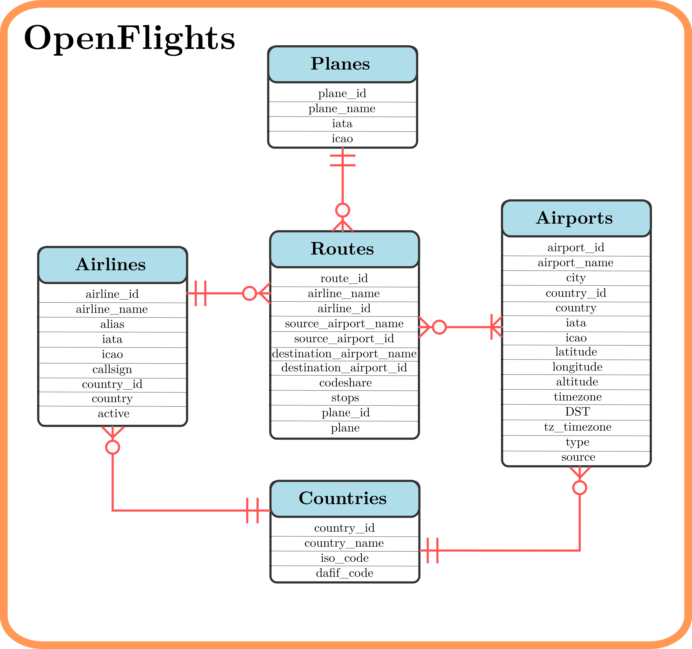
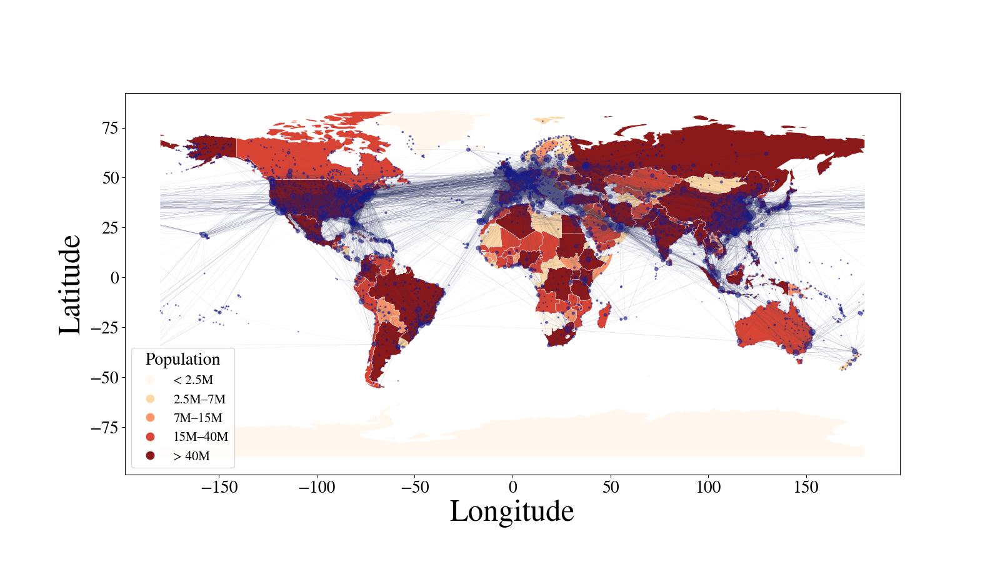

The SQLite database was adapted from the [Open Flights](https://openflights.org/data.php) website. The schema is represented in the following figure:

It can be used as a learning tool for SQLite. Several queries are included in the repository. Using the Python Sqlite library and geopandas, the airline connectivity network is created. This is suitable for network theory analysis. The following image shows the nodes and edges as represented on the world map:

